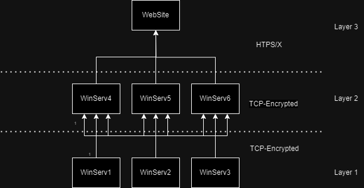
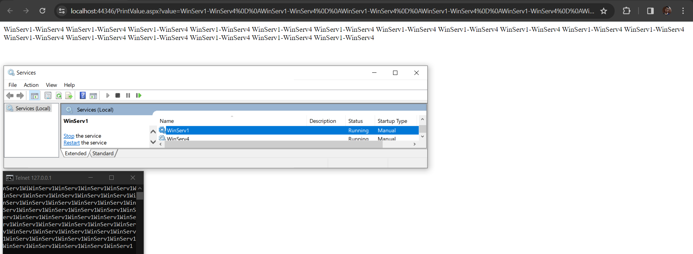

## Welcome to the coding challenge for WCS project (.NET)
**Introduction:**
In this challenge, we expect the developer to be capable of designing, developing, and deploying basic systems on the Windows OS that require the implementation of secure TCP and HTTP/HTTPS communications.

**Objective:**
Develop and implement the necessary code to run the system locally, ensuring that it behaves similarly to the provided image.

**Specific Objectives:**
1. Implement at least one security layer method.
2. Configure services and the website appropriately to display messages.
3. Deploy the system in a local environment.

**System Overview:**
The diagram illustrates the overall system, comprising three layers. The first layer is responsible for sending messages to the second layer, which then concatenates the previous message with the current one before forwarding it to the website. The website is expected to automatically display the messages in a "heartbeat" fashion. Essentially, the system is a collection of sockets continuously transmitting information.

**Requirements:**
1. The services in Layer 1 must be completely connected to those in Layer 2.
2. Only Layer 2 services will have access to the website.
3. Communication must always be secure at every point.
4. Scale horizontally the current services code in order to have the same topology as shown in the image.

*Optional:* Communication with the website can be HTTPS or another preferred secured method.

*Figure 1: General system diagram*

**Expected result:**
This is the result that is expected to see at the end of the challenge.
1. Website showing the messages continuously.
2. First layer sending messages using TCP protocol.
3. System deployed in a local environment. 

*Figure 2: Expected result*